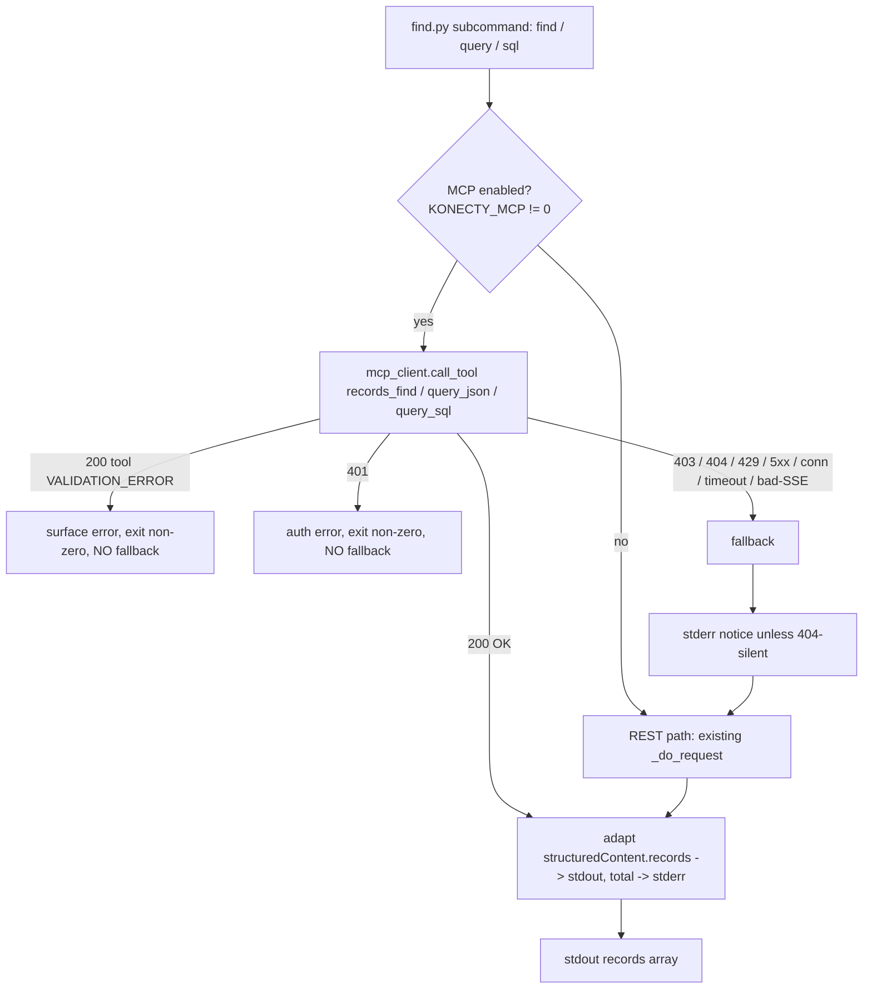

# Find via MCP — Design

**Spec**: `.specs/features/find-via-mcp/spec.md`
**Status**: Draft (grilled — 4 decisions folded in; ADR-0006/0007/0008)
**Related ADRs**: [0006 auth](../../../docs/adr/0006-mcp-auth-legacy-token-not-oauth.md),
[0007 MCP-first+fallback](../../../docs/adr/0007-mcp-first-with-rest-fallback.md),
[0008 nested-filter divergence](../../../docs/adr/0008-known-nested-filter-divergence.md)
**Parity verified** (records_find vs REST find): document id, `withDetailFields`, `getTotal`, `limit=-1`
= IDENTICAL; filter (nested) + query `meta` shape = DIVERGE (handled — ADR-0008 + adapter).

---

## Spike results (both resolved — no live access needed)

Resolved deterministically from the MCP SDK source vendored in
`Konecty/node_modules/@modelcontextprotocol/sdk` and Konecty's own transport wrapper.

| Spike | Question | Result | Evidence |
| ----- | -------- | ------ | -------- |
| **S1 — initialize handshake** | Must a POST carry `initialize` before `tools/call` in stateless mode? | **No.** A bare `tools/call` is dispatched directly. `validateSession` returns early when `sessionIdGenerator === undefined`; `_onrequest` routes by method name with no "initialized" gate. Batching `initialize`+`tools/call` is *rejected* ("Only one initialization request is allowed"), so a handshake isn't even an option — the stateless-per-POST design depends on the bare call working. | `webStandardStreamableHttp.js:584-606` (validateSession), `:421-434` (batch reject), `protocol.js:284-311` (no init gate); Konecty `transport.ts:44-47` |
| **S2 — Accept header + response encoding** | Which `Accept` is required, and is the reply SSE or JSON? | **Accept MUST include BOTH `application/json` and `text/event-stream`** (406 otherwise); **Content-Type MUST be `application/json`** (415 otherwise). Konecty instantiates the transport **without `enableJsonResponse`**, so `_enableJsonResponse=false` → **the reply is SSE** (`Content-Type: text/event-stream`). The client parses SSE frames. | `webStandardStreamableHttp.js:378-385` (Accept/CT), `:61-64` (JSON-mode default false), `:459-520` (SSE vs JSON branch); Konecty `transport.ts:45-47` |

**Live-server finding (real, informs fallback):** `POST https://brain-konecty.konecty.dev/mcp` with a valid
first-party Bearer token returns **`403 mcp_access_denied — "MCP access not configured for this namespace"`**
(from `sessionGuard.ts:45`, fired because `namespace.mcpRoleIds` is empty). This confirms the fallback path
is not an edge case: **any namespace that hasn't opted a role into `mcpRoleIds` will 403**, and the skill must
degrade to REST cleanly. To exercise the live MCP path, an admin must set `mcpRoleIds` on the namespace to
include the user's role `_id` (see *Operational prerequisites*).

---

## Token-source resolution (correctness-critical)

`records_find` / `query_json` / `query_sql` each declare `authTokenId: AUTH_TOKEN_SCHEMA`
(`z.string().optional()`), and resolve the effective token as
`resolveToken(args.authTokenId, deps.authTokenId())` — **argument first, else the header-derived context
token** (`common.ts:37-39`, `records.ts:57`). Two consequences:

1. The **HTTP `Authorization` header is mandatory regardless** — the `requireUserAuth` preHandler
   (`user/server.ts:91-114`) runs before the tool and returns `401` if no credential resolves. So the header
   is what gets us past the auth gate + role allowlist.
2. We **also pass `authTokenId` in the tool arguments** (defensive). The Konecty transport notes the SDK's
   Hono dispatch can drop AsyncLocalStorage (`authContext.ts`), so the context token *could* be absent inside
   the handler on some code paths; passing the arg (which `resolveToken` prefers) makes the call immune to
   that. Same token in both places — no downside.

---

## Architecture Overview

Introduce a small stdlib MCP-over-HTTP client and route each search subcommand through a
**try-MCP-then-fallback-REST** dispatcher. The existing REST functions stay in place and become the
fallback implementation — nothing is deleted.



**Chosen approach: A (isolated client module + dispatcher).** Alternatives considered:

- **A — New `mcp_client.py` + dispatcher in `find.py` (RECOMMENDED).** MCP transport lives in one
  unit-testable module; `find.py` gains a thin per-subcommand "try MCP, on infra-failure call the existing
  REST function" wrapper. Best separation, satisfies spec story P2 (isolated client), smallest blast radius on
  the REST code (untouched, just wrapped).
- **B — Inline MCP into `find.py`.** No new file, but `find.py` (already ~330 lines) balloons and the
  transport can't be unit-tested in isolation. Rejected.
- **C — Client module + promote it to a shared file** for future `konecty-meta`/`admin-mcp` reuse. Rejected
  *now*: this feature is konecty-data-only; adding `mcp_client.py` to `shared-files.txt` imposes the
  byte-identical-divergence burden before there's a second consumer (YAGNI). Revisit when admin-mcp is scoped.

---

## Code Reuse Analysis

### Existing Components to Leverage

| Component | Location | How to Use |
| --------- | -------- | ---------- |
| `_load_credentials()` | `find.py:24-47` | Unchanged — same `KONECTY_URL` + `KONECTY_TOKEN`. Reused by both MCP and REST paths. |
| `_do_request()` REST caller | `find.py:50-95` | Becomes the **fallback** implementation for all three subcommands. Not modified. |
| `_parse_json_arg()` / `_parse_sort()` | `find.py:97-122` | Reused as-is — `--filter` is already canonical KonFilter; `--sort` already yields `{property, direction:UPPER}`. Both map 1:1 to MCP inputs. |
| `_print_results()` | `find.py:125-131` | Reused — the MCP output adapter feeds it the same records-array shape. |
| `cmd_find` / `cmd_query` / `cmd_sql` | `find.py:134-242` | Wrapped by the dispatcher; their current bodies become `_rest_find/_rest_query/_rest_sql` fallbacks. |
| e2e harness mock pattern | `tests/e2e/` (`MockKonecty`) | Extend with a mock `/mcp` endpoint that emits SSE frames + fallback fault injection. |

### Integration Points

| System | Integration Method |
| ------ | ------------------ |
| Konecty User MCP | `POST {KONECTY_URL}/mcp`, JSON-RPC 2.0 `tools/call`, SSE response. |
| Legacy REST | Existing `/rest/data/:document/find`, `/rest/query/json`, `/rest/query/sql` as fallback. |

---

## Components

### `mcp_client.py` (new, local to `konecty-data/scripts/`)

- **Purpose**: Minimal stdlib MCP-over-HTTP client for the stateless Streamable-HTTP User MCP.
- **Location**: `skills/konecty-data/scripts/mcp_client.py`
- **Interfaces**:
  - `call_tool(base_url, token, name, arguments, *, timeout=30) -> dict` — POSTs a JSON-RPC `tools/call`,
    parses the SSE (or JSON) reply, returns the tool `result` object
    (`{content, structuredContent, isError}`). Raises typed errors below.
  - `class McpHttpError(status, body)` — non-2xx HTTP (carries `.status` so the dispatcher can branch
    401/403/404/429/5xx).
  - `class McpTransportError` — connection/timeout/DNS/malformed-SSE (→ fallback).
  - `class McpToolError(code, message, details)` — HTTP 200 but JSON-RPC `error` **or** `result.isError`
    (→ surface, no fallback).
  - `parse_sse(body_bytes) -> list[dict]` — splits `\n\n` frames, concatenates `data:` lines per frame,
    JSON-parses each; returns JSON-RPC messages. (Unit-testable in isolation — spec P2 independent test.)
- **Request shape**:
  ```
  headers = {
    "Authorization": f"Bearer {token}",
    "Content-Type": "application/json",
    "Accept": "application/json, text/event-stream",
    "MCP-Protocol-Version": "2025-06-18",   # supported; optional but explicit
  }
  body = {"jsonrpc":"2.0","id":1,"method":"tools/call",
          "params":{"name": name, "arguments": {**arguments, "authTokenId": token}}}
  ```
- **Response handling**: read full body; if `Content-Type` is `text/event-stream` → `parse_sse`; else
  `json.loads`. Find the message with `id==1` bearing `result`/`error`. On `error` or `result.isError` →
  `McpToolError`. Else return `result`.
- **Dependencies**: `urllib.request`, `urllib.error`, `json` (stdlib only).
- **Reuses**: nothing external; mirrors the header/error idioms already in `find.py`.

### `find.py` dispatcher (modified)

- **Purpose**: Route each subcommand through MCP with automatic REST fallback and the notice policy.
- **Interfaces** (internal):
  - `_mcp_enabled() -> bool` — `os.environ.get("KONECTY_MCP","1") != "0"` **and not** the process-level
    `_mcp_disabled` flag (flipped after a 429).
  - `_dispatch(mcp_call, rest_call) -> None` — runs `mcp_call`; on `McpHttpError`/`McpTransportError`
    applies the fallback matrix (below), emitting the notice first and, on 429, setting `_mcp_disabled`;
    on `McpToolError`/401 surfaces + exits non-zero (no fallback).
  - `_tool_find(args)` / `_tool_query(args)` / `_tool_sql(args)` — build MCP arguments from CLI args.
  - `_rest_find/_rest_query/_rest_sql` — the current `cmd_*` bodies, renamed as fallbacks.
  - `_adapt_mcp(result) -> (records, total, meta)` — extract `structuredContent.records/total/meta`.
- **CLI additions**: none user-facing beyond an env switch. `KONECTY_MCP` env: `1`/unset = MCP-first
  (default), `0` = REST-only (skip MCP entirely — avoids a wasted round-trip + 403 on namespaces known to
  lack MCP), `only` = MCP with **no** fallback (strict mode, for tests/CI diagnostics).
- **Dependencies**: `mcp_client`, existing REST helpers.

### Input mapping (CLI → MCP tool arguments)

| CLI (find.py) | `records_find` | `query_json` | `query_sql` |
| ------------- | -------------- | ------------ | ----------- |
| positional `document` | `document` (must be technical `_id`) | `document` | — |
| positional `sql` | — | — | `sql` |
| `--filter` (KonFilter JSON) | `filter` (pass-through) | `filter` | — |
| `--fields` (csv) | `fields` | (via query obj) | — |
| `--sort` → `{property,direction}` | `sort` | (query obj) | — |
| `--limit` (def 50 / 1000) | `limit` | `limit` | — |
| `--start` | `start` | — | — |
| `--relations` (JSON) | — | `relations` | — |
| `--include-meta` / `--no-total` | — | preserved via query obj | preserved |

`--filter` and `--sort` need **no transformation** — `find.py` already emits canonical KonFilter and
`{property, direction:UPPER}` sort, exactly what `records_find`/`normalizeKonectyFilter` accept. Malformed
JSON is already rejected locally by `_parse_json_arg` before any network call (satisfies FMCP-02).

### Output adapter (uniform across all three tools)

All three tools return `structuredContent { records, total, meta? }`
(`records.ts:71`, `query.ts:151,184`). Adapter:
- `structuredContent.records` → stdout (via existing `_print_results`, same array shape as REST `data`).
- `structuredContent.total` → the `# Total: N  Returned: M` stderr summary.
- `structuredContent.meta` (query/sql) → the `_meta` line. **Shape fix (parity finding 6):** the REST
  `_meta` line is `{ success: true, ...meta, total }`, but MCP returns the **bare** `buildMeta` with `total`
  as a *sibling* and no `success`. The adapter reconstructs the REST-compatible `_meta` as
  `{ "success": true, **meta, "total": total }` so `query`/`sql` output stays byte-compatible.
- Any widget resource-link or extra `content` blocks → **ignored** by construction (we read only
  `structuredContent.records`); no dedicated handling (P3 cut).

---

## Error Handling Strategy (fallback matrix)

| MCP outcome | Handling | User impact |
| ----------- | -------- | ----------- |
| HTTP 200, valid result | Adapt + print | Identical to today's output |
| HTTP 200, JSON-RPC `error` / `result.isError` (VALIDATION_ERROR: bad filter/document/sort) | **Surface** the error, exit non-zero. **No fallback** — it's a query-level problem the user must fix; silent REST fallback could mask it or return inconsistent results. | Clear validation error message |
| HTTP 401 | Surface auth error advising re-login. **No fallback** (bad token fails REST too). | "Auth failed — re-login" |
| HTTP 403 (`mcp_access_denied` / `insufficient_scope`) | Fallback to REST **+ short notice emitted first**. | Results still returned; brief notice |
| HTTP 404 (endpoint absent — old Konecty) | Fallback to REST, **silent** (no MCP is expected there). | Transparent |
| HTTP 429 (rate limited) | Fallback + notice **and set a process-level flag disabling MCP** for all subsequent calls this run. | Results + one notice (not per page) |
| HTTP 5xx | Fallback + notice. | Results + notice |
| Connection error / timeout / DNS | Fallback + notice. | Results + notice |
| Malformed / truncated SSE | Treat as transport failure → fallback + notice. | Results + notice |
| MCP fails **and** REST fallback fails | Surface the **REST** error (actionable), exit non-zero. | Real underlying error |
| `KONECTY_MCP=only` and MCP fails | Surface MCP error, exit non-zero (no fallback). | Diagnostic mode |

**Notice** (grilling decision): only on fallback, one short sentence, emitted **first** on stderr *before*
the records — e.g. `Busca feita via API direta (REST).` Happy MCP path is silent. Kept on stderr so stdout
stays a clean records array for `jq`; emitting it before the stdout write makes it appear up-front in a
terminal without polluting a pipe. The **429 branch additionally flips a module-level `_mcp_disabled`
flag** (per-process; each CLI run is fresh) so deep pagination doesn't 429+notice every page (ADR-0007).

---

## Testing Strategy

- **Unit (mcp_client):** feed canned SSE bytes and canned JSON bytes → assert `parse_sse` + `call_tool`
  extract the same `result`; assert JSON-RPC `error` and `result.isError` raise `McpToolError`; assert
  non-2xx raises `McpHttpError` with `.status`; assert conn-error raises `McpTransportError`.
- **e2e harness:** extend `MockKonecty` with a `/mcp` route that:
  - returns a **200 SSE** frame carrying a `records_find`/`query_json`/`query_sql` result → asserts the
    MCP happy path and byte-identical stdout vs the REST path;
  - can be toggled to return 403 / 404 / 429 / connection-refuse → asserts each fallback branch, the notice
    (or silence for 404), exit codes, and that the REST endpoint is actually hit;
  - returns a 200 SSE with `result.isError` VALIDATION_ERROR → asserts surface + non-zero + no fallback.
- **Coverage:** new `mcp_client.py` + dispatcher branches must keep the suite ≥ 90%
  (`--fail-under=90`). Every fallback-matrix row is a test.
- **`make check`** (offline): `mcp_client.py` byte-compiles; stdlib-only (no new imports beyond
  urllib/json). Not added to `shared-files.txt`.

---

## Risks & Concerns

| Concern | Location | Impact | Mitigation |
| ------- | -------- | ------ | ---------- |
| **Nested-filter silent divergence** — MCP zod-strips `filters` nested 2+ levels → returns a superset vs REST, no error | `filterNormalization.ts:113-127`, `Filter.ts:31-45` (parity finding 5b) | Same `--filter` returns more records via MCP than REST, silently | **Accepted + documented, fix is Konecty-side (ADR-0008).** Skill sends the filter unchanged; `references/find.md` "Known divergences" documents the case + `KONECTY_MCP=0` workaround. Rare (filter_build never generates it). Not routed-to-REST — that would put server-bug knowledge in the wrong layer. |
| Bare/Mongo-style filter — MCP errors, REST would silently return ALL records | `filterNormalization.ts:113` (parity finding 5a) | A malformed filter that today silently returns everything | **Design already handles it correctly:** MCP tool VALIDATION_ERROR → surface, **no fallback** → the user gets a clear error instead of the whole collection. Behavior change (was silent-all-records on REST), strictly safer. |
| Namespace not allow-listed → every MCP call 403s | `sessionGuard.ts:45` (confirmed live) | Without fallback the skill would break on common configs | Fallback matrix (403→REST+notice) is core P1; `KONECTY_MCP=0` opt-out avoids the wasted round-trip where MCP is known-absent. |
| SSE parsing in stdlib is hand-rolled | `mcp_client.parse_sse` (new) | A parsing bug returns wrong/empty records | Isolated + unit-tested against canned frames (spec P2 independent test); malformed SSE → transport error → fallback, never a silent wrong result. |
| AsyncLocalStorage token drop inside handler | `authContext.ts` (documented in Konecty) | Header-only token could resolve null in handler | Pass `authTokenId` in tool arguments too (resolveToken prefers it). |
| MCP-first adds a round-trip on every search | dispatcher | Latency where MCP unavailable | 404 is fast; `KONECTY_MCP=0` disables MCP for known-REST environments; 429 flips the process-level disable. |
| `--limit -1` (no-limit) semantics | `find.py:271` / `find.ts:141-143` | Feared MCP mishandles -1 | **Resolved (parity finding 4): IDENTICAL.** `-1` passes through untouched → `find()` treats it as no-limit on both paths. No special handling needed. |
| Document label vs technical name | `konectyProxy.ts:224`, `loadMetaObjects.ts:42` | Feared MCP wants a different identifier | **Resolved (parity finding 1): IDENTICAL.** Both key `MetaObject.Meta["Contact"]`; the module *name* the skill passes today is the accepted identifier. The tool description's "_id" is a misnomer for the name. A true label ("Contato") errors on both. |

---

## Operational prerequisites (documented for the skill + user)

To use the **live MCP path** (not just fallback), the Konecty namespace must:
1. Have the User MCP enabled (`mcpUserEnabled` — defaults to enabled when unset).
2. Include the caller's role `_id` in **`mcpRoleIds`** (deny-by-default; empty = everyone 403s).
3. (Writes only — N/A here, search is read-only) `mcpUserWriteEnabled`.

These are `konecty-meta namespace` (admin) settings. The skill's `references/find.md` will document that an
unconfigured namespace transparently falls back to REST with a notice, and how an admin enables MCP.

---

## Tech Decisions

| Decision | Choice | Rationale |
| -------- | ------ | --------- |
| Auth on `/mcp` | `Authorization: Bearer <token>` header (mandatory) **+** `authTokenId` arg (defensive) | Header passes the preHandler gate; arg is immune to ALS-drop and `resolveToken` prefers it. |
| Handshake | None — bare `tools/call` | Spike S1: stateless server dispatches directly; batch handshake is rejected anyway. |
| Response parse | SSE-first (`text/event-stream`), JSON fallback | Spike S2: Konecty runs the transport without `enableJsonResponse`. |
| Filter/sort | Pass-through, no `filter_build` tool round-trip | `find.py` already emits canonical KonFilter + normalized sort; avoids a second network hop. |
| Compat | MCP-first + automatic REST fallback; `KONECTY_MCP` env opt-out/strict | User decision; namespace allowlist makes fallback essential. |
| Tool-validation error | Surface, do **not** fall back | A bad query must not be masked by a differently-behaving REST call. |
| New module scope | `mcp_client.py` local to konecty-data, **not** a shared file | Feature is konecty-data-only; avoid the shared-files burden until admin-mcp needs it. |

> **Project-level note:** the `Authorization: Bearer` convention for MCP and the "MCP-first + REST fallback"
> pattern will guide any future MCP migration (e.g. konecty-meta → `/admin-mcp`). Record as a project
> decision in `.specs/project/STATE.md` on Execute.
