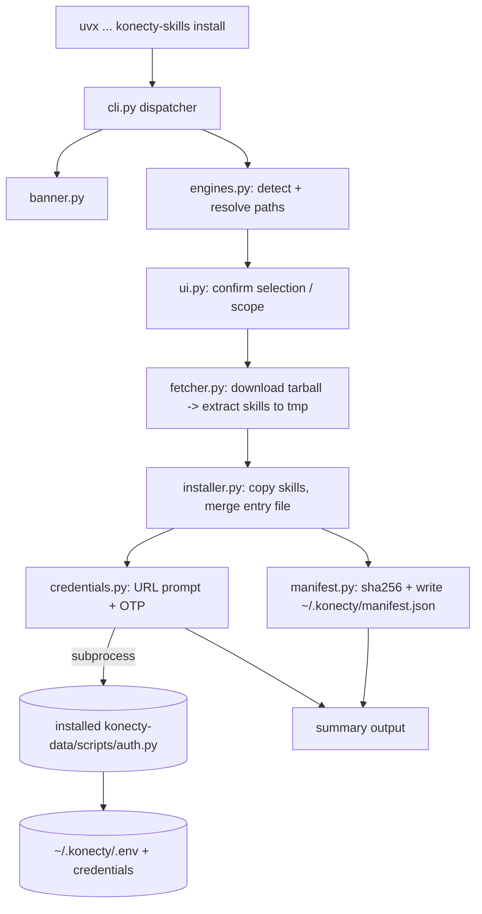

# Konecty Skills Installer (CLI) Design

**Spec**: `.specs/features/konecty-skills-installer/spec.md`
**Status**: Draft

---

## Research findings (Knowledge Verification Chain)

Resolves the spec's open questions Q1–Q3. Verified empirically against the live repo and tools.

- **Repo identity (corrected):** the git remote is `git@github.com:konecty/skills.git` → owner/repo = **`konecty/skills`** (not `KonectySkills`). The public uvx command is therefore:
  ```bash
  uvx --from git+https://github.com/konecty/skills konecty-skills install
  ```
- **Q1 — download mechanism → tarball via `urllib` + `tarfile` (no `git` binary).** Verified: `GET https://github.com/konecty/skills/archive/refs/heads/main.tar.gz` returns 200 after redirect to `codeload.github.com`; `konecty/skills` is **public** (`api.github.com/repos/konecty/skills` → 200). `urllib.request` follows the redirect by default. `git clone` is rejected — it adds a binary dependency for zero benefit.
  - Private-repo fallback (future-proofing): if a download returns 401/404 **and** `GITHUB_TOKEN`/`GH_TOKEN` is set, retry against `https://api.github.com/repos/{owner}/{repo}/tarball/{ref}` with `Authorization: Bearer <token>`. Out of scope to require, in scope to support gracefully.
- **Q2 — reuse of `auth.py` → drive it as a subprocess CLI, do not import its functions.** `skills/konecty-data/scripts/auth.py` is a self-contained stdlib CLI (`request-otp`, `verify-otp`, `login-options`) whose internal functions print to stdout and `raise SystemExit` on errors — they are CLI handlers, not a clean library API. The installer invokes the **freshly-installed** copy via `subprocess`:
  ```
  python3 <dest>/konecty-data/scripts/auth.py request-otp --host <url> --email <id>
  python3 <dest>/konecty-data/scripts/auth.py verify-otp  --host <url> --email <id> --otp <code>
  ```
  `verify-otp` already writes `~/.konecty/.env` and `~/.konecty/credentials` itself (`ensure_env_file` / `ensure_credentials_ini`). Zero duplication; SystemExit becomes a non-zero exit code the installer catches. Contract surface = the three subcommand names + their flags, which are stable.
- **Q3 — engine paths → adopt Reversa's universal-path model.** `.agents/skills/` is the engine-agnostic universal path (AGENTS.md standard, already used by this repo for external skills); `.claude/skills/` is the Claude Code mirror. Project scope writes relative to CWD; global scope writes to `~/.claude/skills/`.

  | Engine | Detection signal (in target dir) | Skills destination (project) |
  |--------|----------------------------------|------------------------------|
  | Claude Code | `.claude/` dir **or** `CLAUDE.md` | `./.claude/skills/` |
  | Universal / Codex | `AGENTS.md` **or** `.agents/` dir | `./.agents/skills/` |
  | Cursor | `.cursor/` dir | `./.cursor/skills/` *(path is this repo's own convention; flagged uncertain — Cursor's canonical skills dir not independently verified)* |
  | (global fallback) | no signal found | `~/.claude/skills/` |

- **Runtime:** installer targets `requires-python >=3.9`, stdlib only (NFR1). Verified `uvx 0.11.19` present; `uvx --from git+…` builds the package from the repo and runs the `konecty-skills` entry point.

---

## Architecture Overview

A thin orchestrator (`cli.py`) dispatches to six single-purpose modules. The flow for `install`: render banner → detect engines → confirm selection → fetch skills tarball → copy into each engine path → merge entry-file block → write manifest → run credential parametrization (OTP). All filesystem mutation goes through `installer.py`/`manifest.py` so the "never destroy user files" invariant lives in one place.



---

## Code Reuse Analysis

### Existing Components to Leverage

| Component | Location | How to Use |
|-----------|----------|------------|
| OTP flow CLI | `skills/konecty-data/scripts/auth.py` | Invoke installed copy via `subprocess` (request-otp → verify-otp). Reuse, never reimplement. |
| `ensure_env_file` / `ensure_credentials_ini` | inside `auth.py` | Reached transitively through `verify-otp`; installer never writes `.env` directly when OTP runs. |
| Banner prototype | `/tmp/konecty-banner/banner.py` (validated) | Move to `installer/src/konecty_skills/banner.py`. |
| Shared-files invariant | `shared-files.txt` (both skills) | No special logic — files are byte-identical in the source tarball, so copy preserves them; `doctor`/`update` hashing naturally re-verifies. |
| Skill source of truth | `skills/konecty-data`, `skills/konecty-meta` | Downloaded at runtime from the tarball; installer is engine-agnostic about their contents. |

### Integration Points

| System | Integration Method |
|--------|--------------------|
| GitHub | `urllib` GET of `archive/refs/heads/{ref}.tar.gz`; extract with `tarfile` |
| Konecty API | only indirectly, via `auth.py` subprocess (OTP) and `doctor`'s health/token probe |
| `~/.konecty/` | `.env` + `credentials` written by `auth.py`; `manifest.json` written by `manifest.py` |

### CONCERNS.md note

`CONCERNS.md` (2026-05-19) predates the 2-skill consolidation and the CI/test work; its "18 skills / no tests / duplicated credential loading" items are stale. The relevant standing item — *shared utilities complicate packaging if skills are distributed individually* — is **honored** here: the installer does **not** introduce a shared util package; it consumes the skills as-is and reuses `auth.py` by subprocess, not by import.

---

## Components

### `cli.py`
- **Purpose**: Argparse dispatcher and the only entry point (`project.scripts`).
- **Location**: `installer/src/konecty_skills/cli.py`
- **Interfaces**:
  - `main(argv: list[str] | None = None) -> int` — parse subcommand, dispatch, return exit code.
  - subcommands: `install`, `configure`, `status`, `update`, `doctor`, `uninstall`.
  - global flags: `--yes/-y`, `--engine {claude,agents,cursor}` (repeatable), `--scope {project,global}`, `--url`, `--ref` (branch/tag/sha, default `main`).
- **Dependencies**: all modules below.
- **Reuses**: stdlib `argparse`.

### `banner.py`
- **Purpose**: Render the colored ASCII banner (7 letters → 7 globe colors).
- **Location**: `installer/src/konecty_skills/banner.py`
- **Interfaces**:
  - `render(color: bool = True) -> str` — returns banner text; `color=False` for non-TTY/`NO_COLOR`.
  - `print_banner(stream=sys.stdout) -> None` — auto-detects TTY + `NO_COLOR` env.
- **Dependencies**: stdlib `os`, `sys`.
- **Reuses**: the validated prototype.

### `ui.py`
- **Purpose**: All user interaction + colored status lines; centralizes non-interactive (`--yes`) behavior.
- **Location**: `installer/src/konecty_skills/ui.py`
- **Interfaces**:
  - `confirm(prompt: str, default: bool, assume_yes: bool) -> bool`
  - `select(items: list[str], preselected: list[str], assume_yes: bool) -> list[str]`
  - `ask(prompt: str, default: str | None = None) -> str`
  - `step(msg) / ok(msg) / warn(msg) / err(msg)` — status lines.
- **Dependencies**: stdlib `input`, `sys`.
- **Reuses**: banner color helpers.

### `engines.py`
- **Purpose**: Detect installed engines and resolve their skills destination paths.
- **Location**: `installer/src/konecty_skills/engines.py`
- **Interfaces**:
  - `detect(root: Path) -> list[Engine]` — uses the detection table above.
  - `dest_path(engine: Engine, root: Path, scope: str) -> Path` — resolve project/global skills dir.
  - `entry_file(engine: Engine, root: Path) -> Path | None` — `CLAUDE.md` / `AGENTS.md`.
- **Dependencies**: stdlib `pathlib`.
- **Reuses**: none.

### `fetcher.py`
- **Purpose**: Download the repo tarball and extract only the two skill folders to a temp dir.
- **Location**: `installer/src/konecty_skills/fetcher.py`
- **Interfaces**:
  - `fetch_skills(ref: str = "main", token: str | None = None) -> FetchResult` — returns `{tmp_dir, skills_root, ref, commit}`. Extracts `skills/konecty-data` and `skills/konecty-meta` only.
  - raises `FetchError` on network/extract failure (caller aborts before any FS mutation).
- **Dependencies**: stdlib `urllib.request`, `tarfile`, `tempfile`, `pathlib`.
- **Reuses**: none. Public-archive URL first; API-tarball + token fallback on 401/404.

### `manifest.py`
- **Purpose**: Own the manifest data model, SHA-256 hashing, and local-modification detection.
- **Location**: `installer/src/konecty_skills/manifest.py`
- **Interfaces**:
  - `load() -> Manifest` / `save(m: Manifest) -> None` — `~/.konecty/manifest.json`.
  - `hash_file(path: Path) -> str` — sha256 hex.
  - `diff(installation, dest: Path) -> list[Conflict]` — files whose on-disk hash ≠ recorded hash (locally modified).
- **Dependencies**: stdlib `hashlib`, `json`, `pathlib`.
- **Reuses**: none.

### `installer.py`
- **Purpose**: Copy skills into engine paths, merge the entry-file block, orchestrate manifest writes — the single chokepoint for the "never destroy" invariant.
- **Location**: `installer/src/konecty_skills/installer.py`
- **Interfaces**:
  - `install(skills_root, engines, scope, manifest) -> InstallReport` — copy via temp + atomic replace per skill dir; record hashes.
  - `merge_entry_block(entry_file: Path) -> None` — insert/replace the `<!-- konecty-skills:start -->…<!-- :end -->` block idempotently; never touches text outside the markers.
  - `update(...)` — re-copy only files whose recorded hash matches current disk (skip locally-modified, report as `Conflict`).
  - `uninstall(installation, purge: bool) -> None` — remove only manifest-listed files; confirm on locally-modified; leave `~/.konecty/.env` unless `--purge`.
- **Dependencies**: `manifest`, `engines`, stdlib `shutil`, `pathlib`.
- **Reuses**: shared-files invariant (passive).

### `credentials.py`
- **Purpose**: URL prompt/validation and the OTP parametrization, delegating to `auth.py`.
- **Location**: `installer/src/konecty_skills/credentials.py`
- **Interfaces**:
  - `current_env() -> dict` — read `~/.konecty/.env` (URL/token present?).
  - `prompt_url(default: str | None) -> str` — validate scheme+host.
  - `run_otp(url: str, auth_py: Path, identifier: str) -> bool` — subprocess `request-otp`, prompt code, subprocess `verify-otp`; returns success. On request failure, allow URL re-entry (spec AC6).
  - `write_url_only(url: str) -> None` — when OTP skipped: write just `KONECTY_URL` via the same `auth.py` env writer path or a minimal stdlib writer with `0o600`.
- **Dependencies**: stdlib `subprocess`, `os`, `urllib.parse`; the installed `auth.py`.
- **Reuses**: `auth.py` (subprocess), `ensure_env_file` (transitively).

---

## Data Models

### Manifest — `~/.konecty/manifest.json`

Global file keyed by **installation root**, so multiple projects + a global install coexist without clobbering each other (the spec's single-path wording is refined here).

```jsonc
{
  "schema": 1,
  "installations": {
    "/abs/path/to/project": {
      "installed_at": "2026-06-17T12:00:00Z",   // stamped by the CLI process (real datetime; this is not a workflow)
      "source": { "repo": "konecty/skills", "ref": "main", "commit": "<sha-or-null>" },
      "scope": "project",
      "engines": ["claude", "agents"],
      "skills": {
        "konecty-data": {
          "dest": ".claude/skills/konecty-data",
          "files": { "SKILL.md": "<sha256>", "scripts/auth.py": "<sha256>" }
        }
      }
    }
  }
}
```

**Relationships**: one installation entry per (root) ; an engine may map to multiple skill dirs; `files` hashes feed `diff()` for update/uninstall safety.

### Credentials — `~/.konecty/.env` (written by `auth.py`, not the installer)

```
KONECTY_URL=https://host
KONECTY_TOKEN=<authId>
KONECTY_USER_ID=<id>   # optional
```
File mode `0o600`, dir `0o700` (already enforced by `ensure_env_file`).

---

## Error Handling Strategy

| Error Scenario | Handling | User Impact |
|----------------|----------|-------------|
| Tarball download fails (network/DNS) | `FetchError` raised **before** any FS write; abort with message + retry hint | Nothing installed; safe to re-run |
| Private repo / 401-404 without token | Detect, suggest `GITHUB_TOKEN`; if present, retry API tarball | Clear actionable message |
| OTP `request-otp` fails (bad URL/4xx) | Catch non-zero exit; re-prompt URL without aborting install (spec P1-cred AC6) | Re-enter URL, install continues |
| OTP `verify-otp` fails (wrong code) | Show auth.py stderr; offer retry or skip | Can finish later via `configure` |
| `~/.konecty/.env` already populated | Show current values, `confirm` before overwrite (AC5) | No silent clobber |
| Entry file edited by user | Block merge only inside markers; never touch surrounding text (NFR2/NFR3) | User content preserved |
| Locally-modified installed file on `update`/`uninstall` | `diff()` flags it; preserve + report (update) / confirm (uninstall) | No lost local edits |
| Crash mid-copy | Copy to temp then atomic per-skill replace; manifest written after copy | No half-written skill dir tracked |
| Non-TTY / `NO_COLOR` / `--yes` | Banner without ANSI; prompts use defaults | CI-safe |

---

## Tech Decisions (non-obvious)

| Decision | Choice | Rationale |
|----------|--------|-----------|
| Reuse of `auth.py` | Subprocess to installed copy | Stable CLI contract; avoids coupling to SystemExit-raising internals; same code path the user runs |
| Download | `urllib`+`tarfile` of public archive | No `git`/no pip deps (NFR1); verified 200 on `konecty/skills` |
| Manifest location | Global, keyed by install root | Supports multiple projects + global install without conflict; refines spec's single-path note |
| Manifest written after copy | post-copy | A crash leaves untracked files (safe to overwrite next run) rather than a manifest pointing at missing files |
| Entry-file merge | marker-delimited block | Idempotent re-install (NFR2); honors "never modify user content" |
| Cursor path | `.cursor/skills/` (flagged) | Repo's own README convention; verify against Cursor docs during EXECUTE before shipping that engine |

---

## Open items carried to EXECUTE

- Verify Cursor's actual skills directory before enabling the `cursor` engine (fall back to `.agents/skills/` if unconfirmed).
- Resolve `source.commit`: best-effort via the archive redirect/`ETag` or a follow-up `api.github.com/repos/{repo}/commits/{ref}` call; acceptable to store `null` for MVP.
- Decide whether `status`/`doctor` read the global manifest filtered to CWD or show all installations (lean: default to CWD, `--all` to list every installation).
